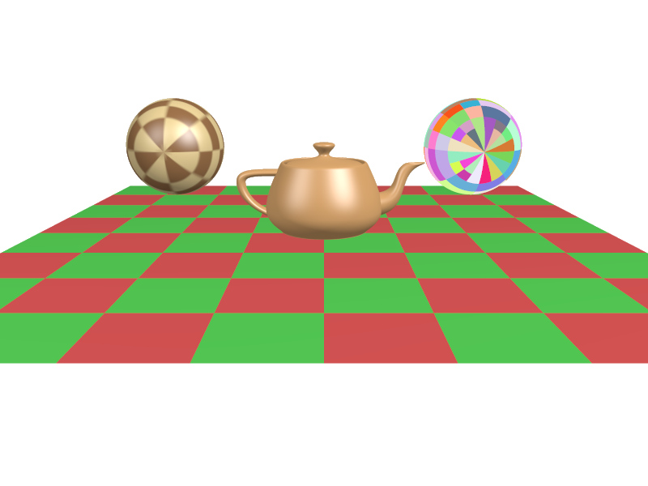

# Rhayes: REYES-style Software Renderer in C



## What is this all about?

I'm Mark VandeWettering, a former Pixar Software Engineer and Technical director.  Back in 1991, I was originally
hired at Pixar to work on Pixar's Photorealistic RenderMan project, and spent a decade as 
part of the RenderMan team, extending and supporting that product for use in our studio and to sell to 
other studios. 

Now, some 35 years later, I find myself in retirement, and with the entire universe talking about AI based coding
and how it is replacing software engineers.  I've done some minor experiments with having AI agents (mostly 
Google's Gemini, but more recently Claude AI) as coding agents.  I became interested in trying to understand 
whether agents could create something as complex as a renderer without any user coding.

This is my (IP) based attempt.

A few caveats:

- There is no code in renderer which is copied from any source which is not public.  The RenderMan Interface was publicly
published precisely so people could write compliant tools and implementation.   The header files used are derived from
that document.  I have no access to any proprietary code from Pixar Animation Studios, and this code uses no such code.
- The algorithms used are documented in [the 1987 Siggraph paper by Cook, Carpenter and Catmull](https://graphics.pixar.com/library/Reyes/), and form the basis of the AI implementation (and largely my own, and probably everyone's) 
understanding of the Reyes algorithm.
- There was a patent granted to Pixar for the use of jittered sampling ([U.S. Patent 4,897,806 ("Pseudo-random point sampling techniques in computer graphics")](https://patents.google.com/patent/US4897806A/en)).  This patent expired in 
2007, and so a future version of this code is likely to implement such techniques to improve anti-aliasing.
- While I am striving for compatibility with this (rather antique and old) version of the specification 
(judging whether an AI can succeed in implementing to a rather complex specification is really the point of this 
project) no guarantees, warranties or the like as to its compatibility or use for any particular purpose is implied
or given.

## AI Assistants

As I mentioned before: this code is was written largely by [Claude Code](https://code.claude.com/docs/en/overview)
with some minor bits perhaps written by [Gemini-CLI](https://geminicli.com/docs/).  I am currently using the $20
a month "Pro" option of Claude Code, and the $20 per month option of Gemini CLI as well.  My early experience
is that Claude is a much better and much less frustrating experience, but the rather spartan limits of the $20 
per month plan for Claude mean that I'm only getting one or two hours per day where I can use it, often with enforced
rate limits kicking in after just thirty minutes at the keyboard.   Nevertheless, it is clear to me that Claude 
does a much better job of creating code, and has a much decreased tendency to get lost in loops or stray off into
irrelevant fixes which have as great a likelihood to break as fix the code.

I have written other interesting bits of code using Gemini 
(see the projects listed/hosted [on mvandewettering](https://mvandewettering.com/pages/) 
for some publicly shared examples, mostly in the realm of single page HTML applications.

## AI is evil!  You're doing evil!

Probably.  I've no doubt that the appearance of AI in the world has been and will continue to be enormously disruptive
to the lives of software engineers and those in the film and media fields.  I can say this with some certainty 
based upon my personal experience in those industries, and my premature departure into retirement somewhat 
earlier than I planned.  Part of this experiment was to determine the degree to which my experience in guiding 
Claude is important, even though I am largely freed from the mechanics of coding individual lines of C, and whether
it represents a true boost in my productivity, and whether code written by such a process can be considered valuable.

I've some preliminary conclusions (now just a few days into the project) but wish to continue a bit longer before
I make them public.

There is a considerable ethical question of course which goes beyond the practical questions.  Coding AIs are only
enabled because they loot the considerable corpus of work that is available on the Internet, a lot of which is 
covered by licenses which may prohibit this kind of reuse as training data (either implicitly or explicitly).  
The degree to which this code may be considered an illegal derivative of some other (unknown to me) work is a 
question that has not yet been resolved legally, and which people can reasonably argue about ethically.  I'm 
happy to engage in such conversations with thoughtful individuals.  Reach out to [me via email](mailto:mvandewettering.com) if you have something you'd like me to consider in this topic.  Respectful conversations appreciated.


## The name "Rhayes"

It's a bit of a joke.  REYES stands for "Render Everything You Ever Saw".  In that spirit, "RHAYES" stands for
"Renders Hardly Anything You've Ever Seen."

I've wanted to make a renderer called rhayes for quite some time.

## Overview
Rhayes is a fast, portable software renderer based on the REYES (Render Everything You Ever Saw) architecture. It is written in strict C99 with no external dependencies beyond the C standard library, ensuring maximum portability.

The renderer implements a classic REYES pipeline: recursive splitting of primitives, dicing into micropolygon grids, shading at vertices, and stochastic sampling for visibility and anti-aliasing.

## Features
- **Pure C99**: Minimal external dependencies (lodepng for PNG I/O).
- **REYES Pipeline**:
    - Recursive splitting and dicing of primitives.
    - Shading in object/eye space before visibility testing.
    - Z-buffer based rasterization with sub-pixel sampling.
- **RenderMan-like API**: Implementation of a subset of the Ri specification.
- **Geometric Primitives**:
    - Quadrics: Sphere, Cylinder, Cone, Disk, Torus, Paraboloid, Hyperboloid.
    - Bicubic Patches and custom "teapot" geometry.
    - Polygons and Polyline support.
- **Basis Matrices**: Support for `RiBasis` (Bezier, B-Spline, Catmull-Rom, etc.).
- **Shading & Lighting**:
    - Surface shaders: `matte`, `plastic`, `metal`, `paintedplastic` (textured), and diagnostic shaders (`random`, `randomgrid`).
    - Light sources: Point and Distant lights.
- **Texture Mapping**:
    - PNG texture loading with automatic mipmap generation.
    - Box-filter decimation for mipmap pyramid.
    - Bilinear texture sampling with automatic mip level selection.
    - Screen-space texture derivatives for proper filtering at all orientations.
    - Correct handling of parametric singularities (e.g., sphere poles).
    - Support for grayscale, RGB, and RGBA textures.
- **RIB Support**:
    - RIB parser for scene description.
    - RIB output for scene serialization.
- **Output**: PNG image format with alpha channel and bKGD chunk support.

## Building
Rhayes uses a standard Makefile.

```sh
# Build the legacy demo executable (rhayes)
make

# Build all utilities (bin/render and bin/catrib)
make programs

# Build everything including libraries
make all programs libs
```

## Usage

### Built-in Demo
Run the default demo which renders a teapot on a checkerboard floor:
```sh
./rhayes
```
This generates `output.png`.

### RIB Renderer
Render any RIB (RenderMan Interface Bytestream) file:
```sh
./bin/render scene.rib
```

### RIB Utility (catrib)
A tool to parse and re-serialize RIB files, useful for debugging or pretty-printing:
```sh
./bin/catrib input.rib -o output.rib
```

## Testing
The project includes a comprehensive test suite that verifies parsing, rendering (against reference images), and round-trip serialization.

```sh
make test
```

## Project Structure
- `src/`: Core implementation of the REYES pipeline and utilities.
- `include/`: API headers and internal configuration.
- `tests/`: RIB test files, reference images, and test runner.
- `bin/`: Compiled executables.
- `lib/`: Compiled static libraries.
- `obj/`: Object files.
- `FSD.md`: Functional System Description.
- `RISPEC.md` / `PARTI.md`: RenderMan Interface Specification documentation.
- `PLAN.md`: Project development plan.

## Work in Progress

Current development focus:
- **Additional Shaders**: Extend texture support to `shinymetal` and other shaders.
- **Trilinear Filtering**: Add interpolation between mip levels for smoother LOD transitions.
- **Displacement Mapping**: Support for procedural and texture-based surface displacement.
- **Motion Blur**: Implement motion blur via temporal sampling.

## License
MIT License.
